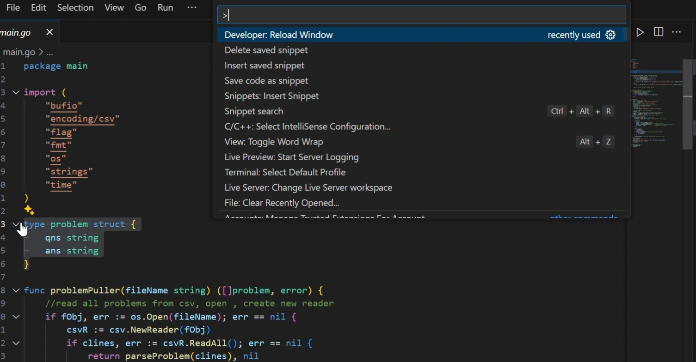

# Snippet-Saver

Snippet-saver is a vscode extension tool, which relies on local storage of your device to provide create, read and delete functionality for code snippets. I have made this extension because I don't trust anyone with my code files and want to keep it in my local machine and I believe you should not trust anyone else for your personal data as well.

## Usage Explained

https://github.com/user-attachments/assets/d30ea24e-bfc0-401d-9812-c4667c950e54

## Features

- Open-Source, you can build it directly from the Github repository.
- Open Command Palette `ctrl+shift+p`.
- Save snippet `snippet-saver.saveSnippet`.
- Insert snippet `snippet-saver.insertSnippet`.
- Delete snippet `snippet-saver.deleteSnippet`.
- 💾 Save selected code as snippets.
- 🔍 Auto-complete snippets using `@snippetname`.
- 📝 Preview snippets before inserting.
- 🗑️ Manage and delete snippets.
- 💼 Workspace-specific snippets (saved in `.vscode/snippets.json`).

## Usage

### Save a Snippet

1. Select code in the editor
2. Press `Ctrl+Shift+P` → "Save code as snippet"
3. Enter a snippet name

### Insert a Snippet

- **Auto-complete**: Type `@` followed by snippet name
- **Command**: `Ctrl+Shift+P` → "Insert saved snippet"

### Delete a Snippet

- `Ctrl+Shift+P` → "Delete saved snippet"

## Requirements

- Nodejs -> v22.13.1 or greater.

## Known Issues

- The update functionality is not yet implemented because of storage error.

## Requirements

VS Code version 1.98.0 or higher

## Release Notes

### 1.0.4

- Added @ auto-completion
- Improved snippet preview
- Bug fixes

### TL;DR

- I won't be adding any functionality which depends on a LLM or any external APIs, as it will be against my product policy of preserving privacy.

### For more information

- [My Github Profile](https://github.com/Adityasinghvats)
- [My Portfolio](https://aditya.webhop.me/)

**Enjoy!**
